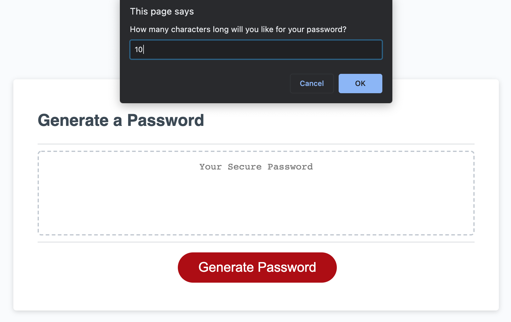

# HW3 Password Generator - Project

## Project Description

This project is intended to generate a random and secured password based on our clients password characters preferences.

---

## Table of Content

1. [Project Description](https://github.com/Brondchux/hw3-password-generator#project-description)
2. [Author Info](https://github.com/Brondchux/hw3-password-generator#author-info)
3. [Acceptance Criteria](https://github.com/Brondchux/hw3-password-generator#acceptance-criteria)
4. [Mock-Up Preview](https://github.com/Brondchux/hw3-password-generator#mock-up-preview)
5. [Useful Links](https://github.com/Brondchux/hw3-password-generator#useful-links)
6. [Credits](https://github.com/Brondchux/hw3-password-generator#credits)
7. [Licence](https://github.com/Brondchux/hw3-password-generator#licence)

---

## Author Info

Name: Gospel Chukwu

Email: hello@gospelchukwu.com

Portfolio: [www.gospelchukwu.com](https://gospelchukwu.com/)

---

## Acceptance Criteria

Below are the critical requirements necessary to develop a secured password generator that satisfies my client’s needs:

```
GIVEN I need a new, secure password
WHEN I click the button to generate a password
THEN I am presented with a series of prompts for password criteria
WHEN prompted for password criteria
THEN I select which criteria to include in the password
WHEN prompted for the length of the password
THEN I choose a length of at least 8 characters and no more than 128 characters
WHEN asked for character types to include in the password
THEN I confirm whether or not to include lowercase, uppercase, numeric, and/or special characters
WHEN I answer each prompt
THEN my input should be validated and at least one character type should be selected
WHEN all prompts are answered
THEN a password is generated that matches the selected criteria
WHEN the password is generated
THEN the password is either displayed in an alert or written to the page
```

---

## Mock-Up Preview

The image below shows the preview of my password generator prompting me to enter my choice of password length:



---

The image below shows the preview of what my password generator should look like when completed with a generated password matching the users specifications:


---

## Useful Links

1. 🗂 [Click me to view github repository for this project](https://github.com/Brondchux/hw3-password-generator)
2. 🌍 [Click me to view deployed application on github pages](https://brondchux.github.io/hw3-password-generator)

---

## Credits

Appreciations to Ben 🙌🏾 of [Columbia University Coding Bootcamp](https://bootcamp.cvn.columbia.edu/coding/landing-ftpt/?s=Google-Brand&msg_cv_scta=4&msg_cv_stbn=1&msg_cv_fcta=1&dki=Learn%20Coding&pkw=%2Bcolumbia%20%2Bcoding%20%2Bbootcamp&pcrid=471112563836&pmt=b&utm_source=google&utm_medium=cpc&utm_campaign=GGL%7CCOLUMBIA-UNIVERSITY%7CSEM%7CCODING%7C-%7COFL%7CTIER-1%7CALL%7CBRD%7CBMM%7CCore%7CBootcamp&utm_term=%2Bcolumbia%20%2Bcoding%20%2Bbootcamp&s=google&k=%2Bcolumbia%20%2Bcoding%20%2Bbootcamp&utm_adgroupid=111600049635&utm_locationphysicalms=9067609&utm_matchtype=b&utm_network=g&utm_device=c&utm_content=471112563836&utm_placement=&gclid=CjwKCAjwlrqHBhByEiwAnLmYUA8CIItksRJF6IT6XMX8WOOJBO-jtCRkzXZhI2gvsZrFEpYdRXy54RoC6jQQAvD_BwE&gclsrc=aw.ds) for being our tutor in this bootcamp.

Special thanks to [Google](https://www.google.com) for helping me find the accurate answers to my questions in a very timely manner.

---

## Licence

Coming soon!
